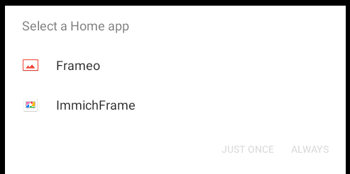
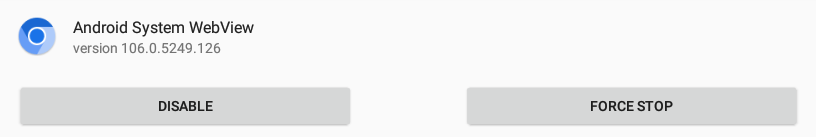

# 📱 Apps

## Apple
### Apple TV
ImmichFrame is available on the [Apple TV App Store][app-store-link].
#### Limitations:
Apple does not allow WebViews for tvOS. This app mimics the WebView look with native controls. It does support the [Remote Control](https://immichframe.dev/docs/getting-started/apps#remote-control)

### iOS (iPhone, iPad, Mac with Apple Silicon)
ImmichFrame is available on the [Apple App Store][app-store-link] for iOS 17+ (iPad 6th gen and newer). Also supports [Remote Control](https://immichframe.dev/docs/getting-started/apps#remote-control)

You can alternatively "install" ImmichFrame as a PWA by opening in a browser and going to Share Menu-Add to Homescreen.

See also: [ImmichFrame Apple repository][github-apple-repo]


## Android
The Android-Version of ImmichFrame is available on the [Google Play Store][play-store-link]. Download it via the store for automatic updates. You can also sideload via APK available in [Releases][github-android-releases].

See also: [ImmichFrame Android repository][github-android-repo]

#### Android Screensaver
##### Android 12 and Below
[How to Set Immich Frame as Android TV Screensaver Video Tutorial][setting-androidtv-screensaver]

##### Android 14
[How to Setup Immich Frame as a Screensaver on Chromecast with Google TV on Android 14][setting-androidtv-14-screensaver]

- Run the app normally and configure settings.
- Go to `Settings > Display > Advanced > Screen Saver > Current Screen Saver` and choose ImmichFrame. `Settings > Display > Advanced > Sleep`, choose your sleep timeout. The menu options may differ slightly on different Android versions.
  - Enable Developer Mode on your Android TV Settings
  - Enable usb debugging
  - Add adb to your system variables so we can execute it in powershell/terminal/cmd 
  - Connect to the android tv device you want the screensaver on by running terminal/cmd/powershell 
    ```bash
    adb connect 192.168.xx.xxx
    ```
    (`192.168.xx.xxx` will be your android tv internal ip ie. `192.168.1.227`) you should see a prompt on your TV screen saying enable adb debugging. Click the checkmark and select ok. (Sometimes you may need to run the command a second time to get it to connect) 
  - If you are unable to set ImmichFrame as a screen saver you may need to run this ADB command 
    ```bash
    adb shell settings put secure screensaver_components com.immichframe.immichframe/.ScreenSaverService
    ```
  - To view screensaver timeout use this ADB command
    ```bash
    adb shell settings get system screen_off_timeout
    ```
  - To set screensaver timeout use this ADB command
    ```bash
    adb shell settings put system screen_off_timeout 60000
    ```
    (timeout is is ms, so this would be 60 seconds).
  - Once done disconnect using command
    ```bash
    adb disconnect 192.168.xx.xxx
    ```
    then re-do the above steps for any other device you want to change the screensaver to immichframe on another android tv device

### Remote Control
The Android app runs a small local HTTP server on port 53287 that accepts commands `dim`, `undim`, `next`, `previous`, `pause`, `settings`, `brightness?value=x`.  
Brightness value must be a float between 0.00 and 1.00, or -1.00 to use the system default.   
Examples:  
```shell
curl http://192.168.0.136:53287/next
```  
```shell
curl "http://192.168.0.136:53287/brightness?value=0.5"
```

### Frameo
ImmichFrame can be run on inexpensive Frameo digital photo frames with some additional effort. You can typically find these for ~$40 USD. 

Frameo digital photo frames are low powered and run a very old Android version, so they cannot run the full WebView version of the app (however most of the main features are still supported except SplitView). 

> [!NOTE]
> We have found a method to update the WebView, but it is not without risks, see Frameo Webview Update below.
> 
> Webview provieds the following features that are not available without it: 
> - SplitView
> - Some image formats (HEIC)
> - Video playback (experimenta)
> - Better text rendering
> - Show Tag, desc, and album info from Immich.
> - Configurable layout, (size, background and overlay colors, and blur effects, etc). 

  1. You will need to install ADB on your PC ([ADB instructions][ADB-link]).
  
  2. Enable ADB on the Frameo device. ADB is often enabled on these devices by default, if it is not go to Frameo Settings-About-Enable Beta Program. Toggle ADB Access On-Off-On. 
  
  3. Connect via USB. Next to the power port on the Frameo device there is a USB port, connect this to your PC with a USB cable.

  4. Verify connection with `adb devices` command, you should see your device listed. If not, try unplugging and re-plugging the usb cable, or restarting the device while connected via usb.
  
  5. Download the latest ImmichFrame APK from the [GitHub Releases][github-android-releases] page to your PC. 

     For linux or mac you can run the following command to download the latest release directly to your current directory:

     ```bash
     curl -L -o ImmichFrame.apk $(curl -s https://api.github.com/repos/immichFrame/ImmichFrame_Android/releases/latest | grep "browser_download_url.*apk" | cut -d : -f 2,3 | tr -d \")
      ```

     For windows you can run the following command in powershell to download the latest release directly to your current directory:
     ```powershell
     Invoke-WebRequest -Uri (Invoke-RestMethod -Uri https://api.github.com/repos/immichFrame/ImmichFrame_Android/releases/latest).assets | Where-Object { $_.name -like "*.apk" } | Select-Object -First 1 -ExpandProperty browser_download_url | Invoke-WebRequest -OutFile ImmichFrame.apk
     ```

  6. Sideload ImmichFrame:
     ```bash
     adb install /path/to/ImmichFrame_vXX.apk
     ```

     **Update/reinstall existing ImmichFrame:**
     ```bash
     adb install -r /path/to/ImmichFrame_vXX.apk
     ```
  7. Start ImmichFrame:
     ```bash
     adb shell am start com.immichframe.immichframe/.MainActivity
     ```
  8. Configure and disable WebView:  
     1. Swipe down to enter ImmichFrame Settings
     2. Configure URL and Authorization Secret (optional)
     3. Disable WebView

  9. Set as default HOME app:
  
     On first reboot after install you will be asked to select default Launcher, select `ImmichFrame` and select "Always"
     
     

   10. Then disable the Frameo app to set ImmichFrame as only Home app:

       > [!NOTE]
       > This is not possible with latest app version (< 1.29) so uninstalling updates (to 1.24) is required to get the overwriting of default home app to work. If you have already updated the Frameo app, you can uninstall updates by going to Android Settings-Apps-Frameo-Uninstall Updates.

       ```bash
       adb shell su
       pm disable net.frameo.frame
       exit
       adb reboot
       ```
      If this doesn't stick on reboot, repeat the commands but power cycle after exit command

      

#### Some other useful ADB commands:

**Reboot:**

```bash
adb reboot
``` 

> [!NOTE]
> You can also reboot or shutdown by holding down power button

**Access Android Settings:**

```bash 
adb shell am start -a android.settings.SETTINGS
```

#### Re-enable Frameo

1. Enable Frameo again with ADB command:
    ```bash
    adb shell su
    pm enable net.frameo.frame
    exit
    ```

2. Start Frameo app:
    ```bash 
    adb shell am start net.frameo.frame
    ```

3. Uninstall ImmichFrame:
    ```
    adb uninstall com.immichframe.immichframe
    ```
  
### Frameo WebView Update  
Follow instructions below to update WebView to 106. 

This has been tested and working on Android 6.01 10.1" Frameo devices.

1. Download WebView 106 to PC:
  
   [Lineage OS WebView 106-0-5249-126-12 (arm64-v8a + arm-v7a) (Android 6.0+)][webview-update]

2. Push new apk to sdcard
    > [!NOTE]
    > Android does not have auto complete so you will save time if the new file is /sdcard/webview.apk, so you can just run `adb push /path/to/webview.apk /sdcard/webview.apk` and it will be named webview.apk on the device.
    ```shell
    adb push /path/to/your/new/webview.apk /sdcard/webview.apk
    ```
3. Enter shell and switch to the root user
    ```shell
    adb shell su
    ```
4. Backup original WebView APK
    ```shell
    mount -o rw,remount /system && cp /system/app/webview/webview.apk /system/app/webview/webview.apk.bak
    ```
5. Delete the oat folder recursively
    ```shell
    mount -o rw,remount /system && rm -rf /system/app/webview/oat
    ```
6. Copy new WebView to system    
    ```shell
    mount -o rw,remount /system && cp /sdcard/webview.apk /system/app/webview/webview.apk
    ```
7. Reboot device
    ```shell
    adb reboot
    ```
    After reboot, you should see a "installing new app" notification, and then you can verify the new WebView version by going to Android `Settings-Apps`, top right corner triple dot menu `show system`, Android System WebView.

    

> [!NOTE]
> Depending on the device or Android version, the location to the webview apk may be different for you. You can locate it with:
>  ```shell
> adb shell pm path com.android.webview
> ```

#### Alternative WebView Method
If the above method does not work, or you receive permissions issue, try this [Alternative Method][alternate-webview-method]


## Desktop (Windows, MacOS, Linux)

Get the latest Desktop-App from the [GitHub Releases][releases-url] page.

The screen is configured in a 3x3 gird. You can touch or click:

|         -          | **Settings** |         -          |
| :----------------: | :----------: | :----------------: |
| **Prev<br/>image** |  **Pause**   | **Next<br/>image** |
|         -          |   **Quit**   |         -          |

### MacOS

- Open DMG, drag immichframe.app to applications folder.
- If you get an error that it is "damaged and can't be opened, you should move it to the trash" run following command in terminal.
  ```bash 
  xattr -c /Applications/immichframe.app
  ```

## Keyboard
**Settings** - Up arrow  
**Quit** - Down arrow  
**Prev Image** - Left arrow  
**Next Image** - Right arrow  
**Pause** - Enter/Return  


<!-- MARKDOWN LINKS & IMAGES -->
[play-store-link]: https://play.google.com/store/apps/details?id=com.immichframe.immichframe
[github-android-repo]: https://github.com/immichFrame/ImmichFrame_Android
[github-android-releases]: https://github.com/immichFrame/ImmichFrame_Android/releases
[github-apple-repo]: https://github.com/immichFrame/ImmichFrame_Apple
[app-store-link]: https://apps.apple.com/us/app/immichframe/id6742748077
[releases-url]: https://github.com/immichFrame/ImmichFrame_Desktop/releases/latest
[ADB-link]: https://www.xda-developers.com/install-adb-windows-macos-linux/
[webview-update]: https://www.apkmirror.com/apk/lineageos/android-system-webview-2/android-system-webview-2-106-0-5249-126-release/android-system-webview-106-0-5249-126-12-android-apk-download/
[setting-androidtv-screensaver]: https://youtu.be/m3Arh-hrWks
[setting-androidtv-14-screensaver]: https://youtu.be/78z0Rs8KhsE?si=VQyuFnFITVTizYOf
[alternate-webview-method]: https://docs.demonwarriortech.com/Documented%20Tutorials/Immich%20Frame/Frameo_Setup/#frameo-troubleshooting
